# Covid19 Vaccination Appointments Sign Up
The goal of this project is to build a web-based system for signing up people for COVID-19 vaccinations. The first part of this project is to design and build a database for the system and the second part is to create a web-based user interface and implement the features.

## Database Design (Relational Schema)
First, there are three types of participants: patients, providers and administrators (we assume that admins can directly access database).
Patients can sign up in the system, and provide necessary information. Patietns can also choose their time preference and distance preference for the vaccination.
Patients can choose to accept/decline an vaccination offer and cancel an offer afterwards.

Providers can also sign up in the system, and provide necessary information. They can also add appointments, update appointments status and look up appointment info.
The system will match available appointments with patients according to their preference periodically.

The following are the ER DIAGRAM for the relational schema.

## Website Overview
### Homepage
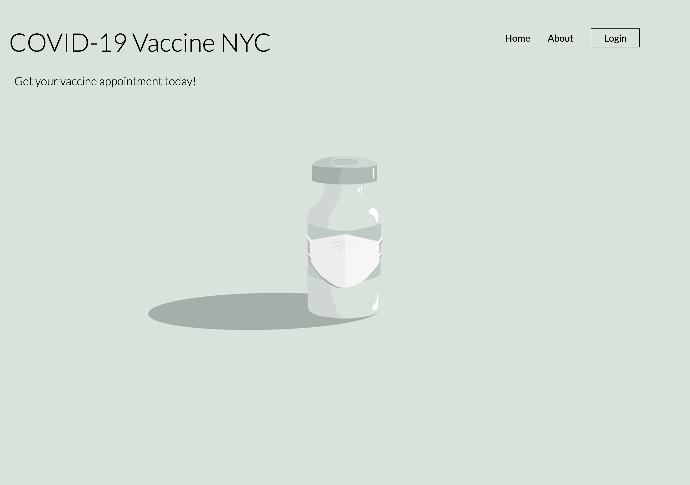

### Register
Register as provider:
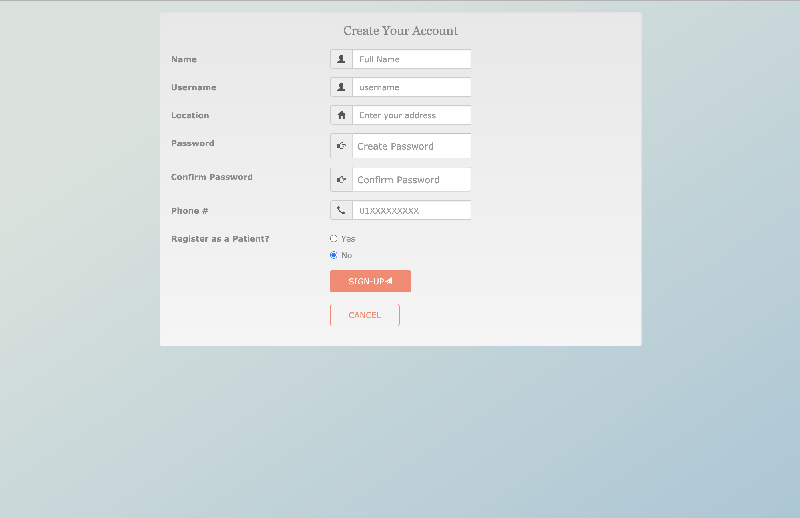

Register as patient:
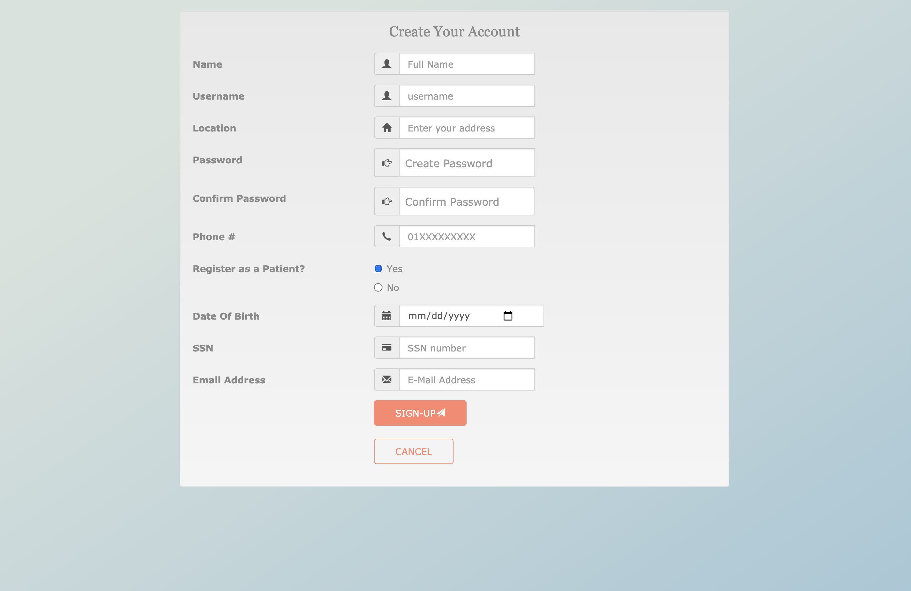

### Login

### Provider Dashboard:
Default showing all the upcoming appointments:
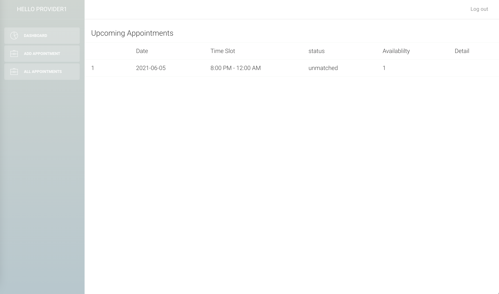

One can add new appointment (the system will match existing patinet if it matches the preference):
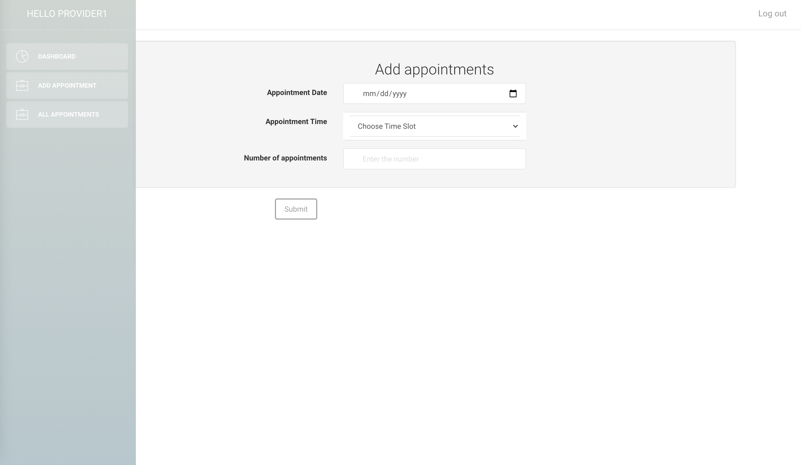

One can access all the appointments with more details:
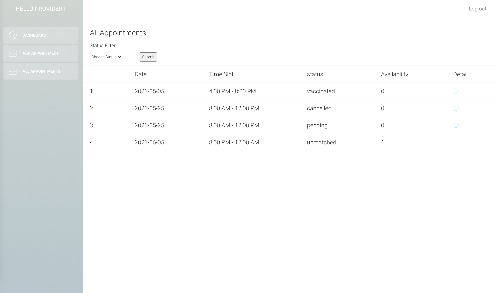

And go over the details of the appointment:
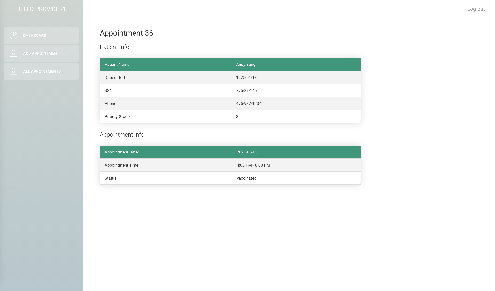

### Patient Dashboard:
The dashboard will show all the matched appointment:
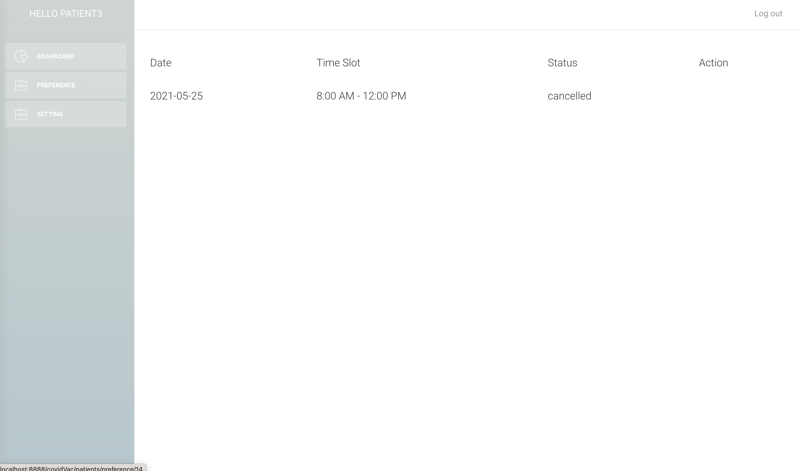
If the appointment has status "pending", patient will have the option to decline or accept.
If the appointment has status "accepted", patient will have the option to cancel.
Declined and cancelled appointments will go back to the pool to match new patients.

Patient can update one's preference:
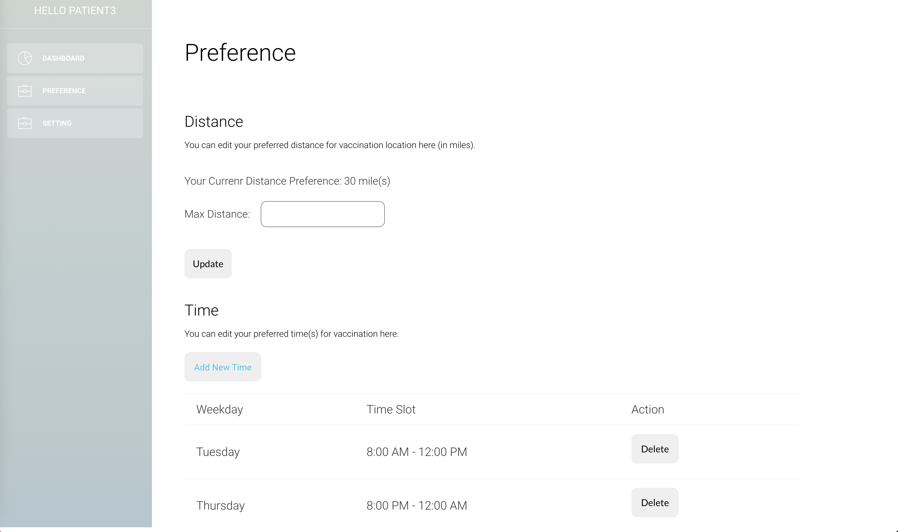

Adding new time:
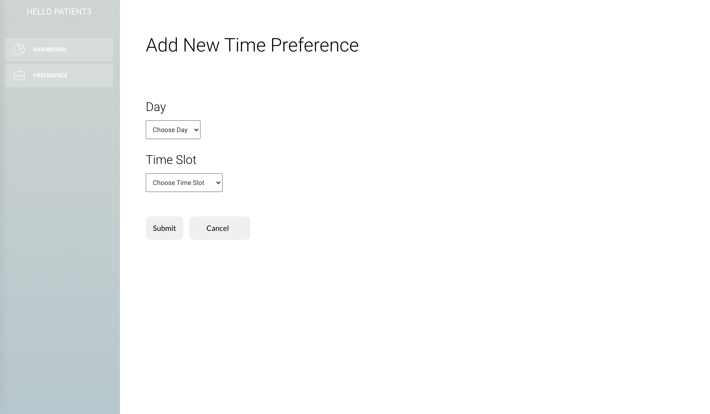

And upadte one's personal info:
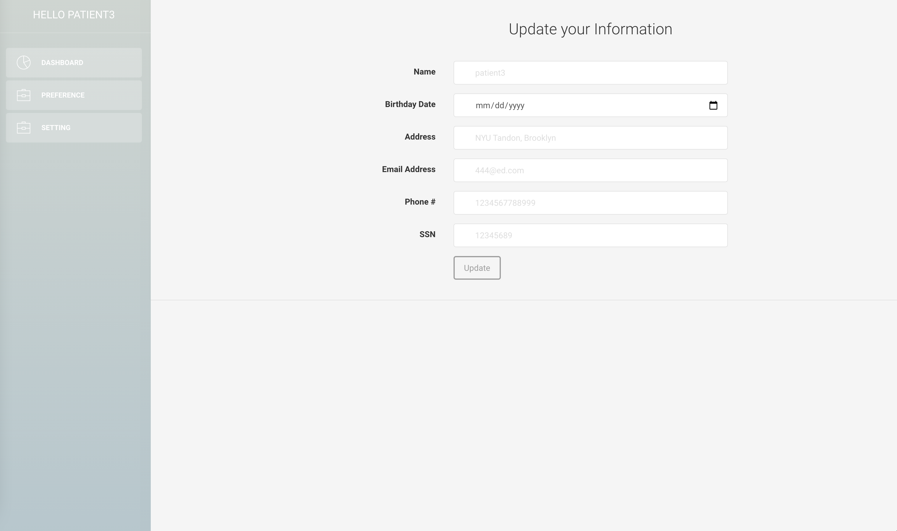

## Summary:
This project is a graduate course project in NYU Tandon. The purpose of this project is to explore the design of relational database and integrate it into real-life application. 

The databse we use is MySQL. And we use MAMP to develop and test the website functionalies.